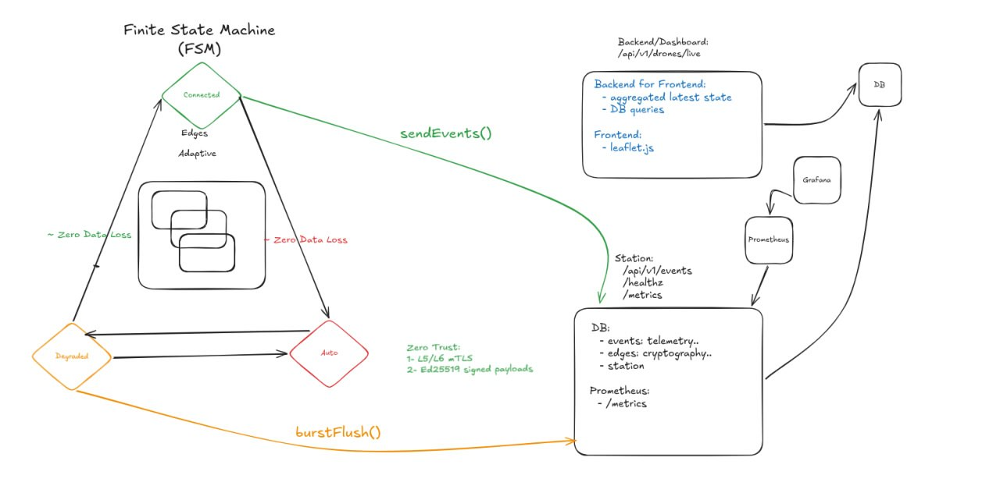

# Drone Fleet Command & Control (C2) Infrastructure

This repository defines a robust, Zero-Trust Command and Control (C2) architecture for managing distributed IoT edge
devices (drones). It is designed to handle high-frequency telemetry ingestion, severe network partitions, and
adversarial network environments without compromising data integrity or losing a single data point.

## 1. Problem Statement

Operating fleets of autonomous vehicles in remote areas presents two fundamental engineering challenges:

1. **Network Instability:** Drones frequently fly through dead zones. Traditional fire-and-forget telemetry pipelines
   lose critical operational data when the connection drops.
2. **Security & Identity:** If a physical asset is captured or compromised, the central server must ensure that the
   compromised hardware cannot be used to forge data for the rest of the fleet or pivot into the control plane.

This architecture solves both problems by coupling an Offline-First Finite State Machine (FSM) with a Dual-Layer
Cryptographic Security model.

---

## 2. Core Architectural Idioms

* **Zero Trust (Defense in Depth):** The network is assumed to be hostile. We do not use API keys or static passwords.
  Identity is cryptographically proven at both the Transport (L4) and Application (L7) layers.
* **Zero Data Loss (Eventual Consistency):** The edge daemon treats network connectivity as a luxury, not a requirement.
  Data generation is entirely decoupled from data transmission.
* **Plane Separation:** The system strictly isolates the Data Plane (machine-to-machine telemetry), the Control Plane (
  human-to-machine web dashboards), and the Observability Plane (metrics scraping).

---

## 3. The Edge Finite State Machine (FSM)

Every edge device runs a standalone Go daemon governed by a strict Finite State Machine. This FSM dictates how the drone
handles telemetry based on real-time network conditions.

* **State: CONNECTED**
    * **Condition:** Network is up, Station health checks pass.
    * **Action:** Telemetry events are generated, cryptographically signed, and transmitted immediately via
      `sendEvents()`.
* **State: AUTONOMOUS (Offline Mode)**
    * **Condition:** The network drops or the Station becomes unreachable.
    * **Action:** The drone continues to fly its mission. Telemetry is generated, signed, and safely pushed to a local
      ring buffer (Cache). The drone periodically probes the Station for health.
* **State: DEGRADED (Recovery Mode)**
    * **Condition:** The network is restored, but the local cache still holds historical data.
    * **Action:** The daemon executes a concurrent `burstFlush()`. Using Go routines, it aggressively flushes the cached
      events to the Station while maintaining chronological order. Once the cache is empty, the FSM transitions back to
      `CONNECTED`.

---

## 4. Security Architecture

The system employs a strict, two-tiered authentication model before any data is written to the database.

### Layer 4: Mutual TLS (mTLS) via TCP Passthrough

The ingestion endpoint (Port 5002) is not a standard web server. It sits behind an Nginx reverse proxy configured for *
*Raw TCP Passthrough**.
Before an HTTP request can be formed, the edge device must present an X.509 client certificate (`edge.pem`) signed by
the internal Certificate Authority. If the certificate is missing or invalid, the Go server terminates the TCP
connection immediately.

### Layer 7: Ed25519 Payload Verification

If the mTLS tunnel is successfully established, the server evaluates the JSON payload. Every individual event contains a
signature generated by the drone's unique Ed25519 private key.
The Station verifies this signature against the drone's known public key. This ensures that even if a TLS session key is
compromised, the telemetry data itself cannot be forged or tampered with.

---

## 5. Concurrency and Backend Performance

The Station server is designed to handle thousands of concurrent drone connections without bottlenecking on database
reads.

### The Lazy-Loading KeyManager

To verify L7 signatures rapidly, the Station caches all fleet Public Keys in memory. However, Go maps are not
thread-safe. To solve this, the `KeyManager` uses a `sync.RWMutex`.

* **Fast Path:** Thousands of incoming requests can read the key cache simultaneously without locking the thread.
* **Slow Path (Lazy Load):** If a signature fails, the server assumes the key might have been rotated. It acquires a
  Write Lock, queries the SQLite database for a new key, updates the cache, and releases the lock. This allows operators
  to seamlessly rotate cryptographic keys in the field without ever restarting the Station server.

### Observability

The Station exposes a dedicated, internal-only HTTP port (5003) for Prometheus. As telemetry is processed, the Go server
updates `GaugeVec` metrics in memory. Prometheus periodically pulls these metrics, allowing Grafana to visualize fleet
health, altitude, and battery levels with zero impact on the ingestion database.

---

## 6. Evolution to Production IoT Hardware

While this repository utilizes a simulator and local SQLite databases for scaffolding, the Go architecture is designed
to map directly to physical hardware:

1. **Hardware Root of Trust:** The Ed25519 private keys and mTLS certificates, currently stored as Base64 strings, will
   be moved into physical Trusted Platform Modules (TPMs) or Secure Enclaves on the drone companion computers (e.g.,
   Raspberry Pi or Jetson Nano). The keys will never touch the filesystem.
2. **Cross-Compilation:** The `edged` daemon is written in pure Go, allowing it to be seamlessly cross-compiled into a
   single static binary for `linux/arm64` and deployed directly to the drones.
3. **Time-Series Database:** As the fleet scales, the central SQLite database can be swapped for a distributed
   time-series database (like TimescaleDB or InfluxDB) simply by updating the `internal/db` interface, leaving the core
   ingestion logic untouched.

---

## 7. Civilian Use Case Scenarios

This highly resilient data pipeline is ideal for critical civilian and commercial applications where network
connectivity is sparse but data integrity is paramount:

* **Precision Agriculture:** Swarms of drones mapping vast rural farmlands. The drones can scan crops in disconnected
  zones and automatically burst-sync the multi-spectral telemetry the moment they return to the base station's local
  network.
* **Disaster Response & Search and Rescue:** Operating in areas where cellular infrastructure has been destroyed by
  hurricanes or earthquakes. Edge devices can execute search patterns autonomously and sync survivor coordinates as soon
  as they achieve a brief line-of-sight connection with a high-altitude relay.
* **Environmental & Wildfire Monitoring:** Tracking shifting fire lines or migrating wildlife in deep wilderness. The
  FSM ensures that critical timestamps and coordinate changes are never lost, even if the drone is out of contact for
  hours.

---

Would you like me to write a `docker-compose.yml` file that spins up this entire layered architecture (Nginx, Stationd,
Prometheus, Grafana, and the Edge Simulators) so you can run it with a single command?